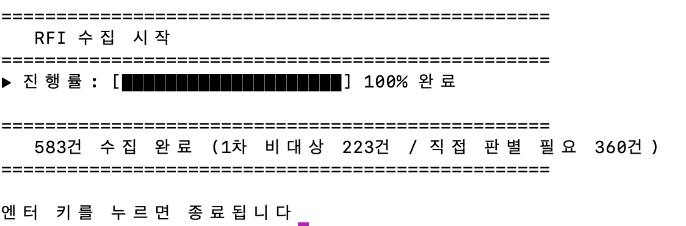
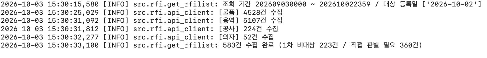
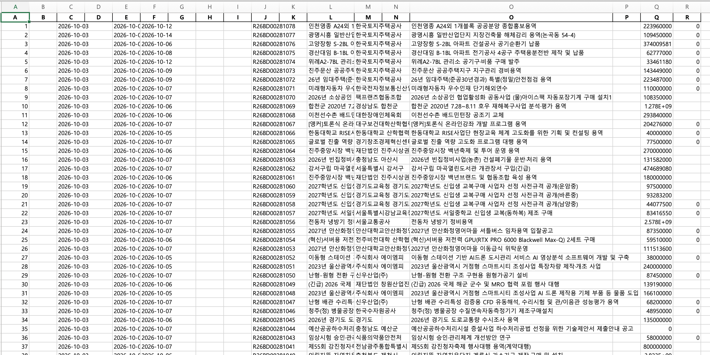
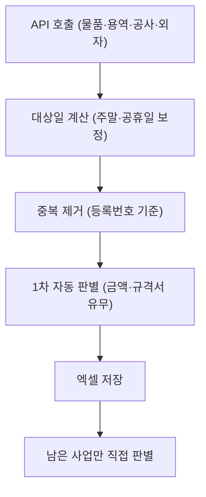

# RFI Collector

> 나라장터(G2B) 사전규격(RFI)을 자동 수집하고, 소프트웨어사업 대상 여부를 **1차 자동 판별**하는 도구  
> 하루 **3~4시간** 걸리던 수작업 판별을 **30분**으로 단축했습니다.


<p align = 'center'></p>
<p align = 'center'>▲ [그림 1] RFI 수집기 데이터 수집 실행 화면

&nbsp;

<p align = 'center'></p>
<p align = 'center'>▲ [그림 2] rfi log 화면  

&nbsp;

<p align = 'center'></p>
<p align = 'center'>▲ [그림 3] 실행 결과 엑셀 화면  

## 📌 배경

소프트웨어사업 대상 여부를 판별하기 위해 기존에는 아래 과정을 매번 수작업으로 진행했습니다.

1. 나라장터(www.g2b.go.kr)에서 해당 날짜의 사전규격 **전체 리스트를 엑셀로 다운로드**
2. 사업을 **하나하나 열어보며** 판별
   - 사업 금액이 **1억 원 이상**인가?
   - 사업 내용이 **소프트웨어 관련**인가?

대부분의 사업이 금액 미달이거나 규격서가 없는 비대상 건이었지만 전수를 일일이 확인해야 해서 **하루 약 3~4시간**이 소요되었습니다.

## 🎯 해결 방법

공공데이터포털의 나라장터 사전규격정보 API로 리스트를 자동 수집하고, **금액·규격서 유무로 1차 필터링**한 뒤 **남은 사업만 직접 판별**하도록 업무 흐름을 바꿨습니다.



## 📊 성과

| 구분 | 기존 | 자동화 후 |
|------|------|-----------|
| 소요 시간 | 약 3~4시간 | 약 30분 |
| 리스트 확보 | 사이트 접속 후 수동 다운로드 | 실행 한 번으로 자동 수집 |
| 판별 대상 | 전체 사업 | 1차 필터를 통과한 사업만 |


## ✨ 주요 기능

- **4개 분야 일괄 수집**: 물품 / 용역 / 공사 / 외자 사전규격을 한 번에 조회
- **영업일 자동 보정**: 전일이 주말·공휴일이면 직전 영업일까지 거슬러 올라가 해당 기간의 등록 건을 모두 수집 (연말연초 연휴 포함, `holidays` 한국 공휴일 기준)
- **중복 제거**: 사전규격등록번호(없으면 발주계획번호) 기준
- **1차 자동 판별**: 아래에 해당하면 비대상(`R = 0`)으로 표시
  - 배정예산이 기준 금액 미만 (약 1억 원, 부가세 제외 환산 `90,909,091`원)
  - 규격서 파일 URL이 없는 사업
  - 예산이 미입력(≈0)인 사업은 놓치지 않도록 **제외하지 않고** 직접 판별 대상으로 남김.
- **안정적인 API 호출**: 타임아웃, 재시도, 응답 코드 검증. 일부 분야만 실패하면 완료 메시지에 어떤 분야가 실패했는지 표시
- **인증키 보호**: 오류 메시지·로그에서 API 키를 자동으로 가림
- **엑셀 결과 저장**: `사전규격_YYMMDD.xlsx` (저장 폴더는 선택 창에서 지정, 취소 시 기본 폴더)
- **진행률 표시 / 로그 파일**: 콘솔 진행률 바, 상세 기록은 `rfi.log`
- **단독 실행 파일 배포**: PyInstaller로 `RFI.exe` 생성 → Python 설치 없이 사용 가능

## 🛠 기술 스택

- Python 3.10+
- **API**: 공공데이터포털 조달청 나라장터 사전규격정보서비스 (`HrcspSsstndrdInfoService`)
- **라이브러리**: requests, pandas, openpyxl, holidays, python-dotenv
- **테스트/배포**: pytest, PyInstaller

## 🚀 설치 및 실행

### 1. 설치

```bash
git clone https://github.com/ihag/rfi-collector.git
cd rfi-collector
pip install -r requirements.txt
```

### 2. API 키 설정

[공공데이터포털](https://www.data.go.kr)에서 **조달청 나라장터 사전규격정보서비스**를 활용 신청하고, 발급받은 **일반 인증키(Decoding)** 를 `.env`에 넣어주세요.

```bash
cp .env.example .env
```

```env
API_KEY=발급받은_인증키
```


### 3. 실행

```bash
python main.py
```

1. 저장 폴더 선택 창이 뜹니다 (취소하면 기본 폴더에 저장)
2. 진행률 바와 함께 수집·1차 판별이 진행됩니다
3. 완료 메시지가 표시되고 엑셀 파일이 생성됩니다

```
=====================================================
예시)
   420건 수집 완료 (1차 비대상 300건 / 직접 판별 필요 120건)
=====================================================
```

> ⚠️ 저장 폴더 선택 창은 PowerShell을 사용하므로 **Windows**에서만 표시됩니다. 그 외 환경에서는 기본 폴더에 저장됩니다.

### 4. (선택) exe 빌드

```bash
pip install -r requirements-dev.txt
pyinstaller --onefile --name RFI main.py
```

`dist/RFI.exe`와 같은 폴더에 `.env`를 두면 됩니다. 결과 파일과 `rfi.log`도 exe가 있는 폴더에 생성됩니다.

## ⚙️ 설정값 변경

수집 기간, 금액 기준 등은 `src/common/config.py`에서 수정합니다.

| 설정 | 기본값 | 설명 |
|------|--------|------|
| `LOOKBACK_DAYS` | 30 | API 조회 시작일 = 오늘 − N일 |
| `MIN_BUDGET_EXCL_VAT` | 90,909,091 | 1차 판별 금액 기준 (1억 ÷ 1.1) |
| `BUDGET_UNSET_MAX` | 10 | 이 값 이하 예산은 '미입력'으로 간주 |
| `MAX_RETRIES` / `REQUEST_TIMEOUT` | 3 / (5, 30)초 | API 재시도·타임아웃 |

## 📄 결과 파일

| 열 | 내용 |
|----|------|
| A | 순번 |
| C | 수집일 |
| E | 사전규격 등록일 |
| F | 의견등록 마감일 |
| J | 사전규격등록번호 (없으면 발주계획번호) |
| L | 품명 (물품분류) |
| M | 수요기관 |
| Q | 배정예산 |
| R | **1차 판별 결과** (`0` = 비대상, 빈 칸 = 직접 판별 필요) |

나머지 열(B, D, G, H, I, K, N, P 등)은 빈 칸으로 생성되며 수기 판별·기록용으로 사용합니다.

## 📁 프로젝트 구조

```
.
├── main.py                    # 진입점
├── src/
│   ├── common/
│   │   ├── config.py          # 경로, API 주소, 판별 기준 등 설정
│   │   ├── errors.py          # 사용자에게 보여줄 예외 정의
│   │   ├── utils.py           # API 키 로드, 영업일/공휴일 계산, 로깅
│   │   ├── folder_dialog.py   # 저장 폴더 선택 창 (Windows)
│   │   └── progress_ui.py     # 콘솔 진행률 UI
│   └── rfi/
│       ├── api_client.py      # API 호출 (재시도, 응답 검증, 키 마스킹)
│       ├── processor.py       # 가공 및 1차 자동 판별
│       └── get_rfilist.py     # 수집 → 가공 → 저장 파이프라인
├── tests/                     # 단위 테스트 (네트워크 불필요)
├── requirements.txt
├── requirements-dev.txt
├── .env.example
└── README.md
```

## 🧪 테스트

```bash
pip install -r requirements-dev.txt
pytest
```

영업일 계산(주말·연휴·연말연초), 1차 판별 로직(금액 경계값, 규격서 유무, 중복 처리)을 API 호출 없이 검증합니다.

## ⚠️ 참고 및 한계

- 1차 판별은 **금액과 규격서 유무**만 기준으로 하며, "소프트웨어 관련 여부"의 최종 판단은 사람이 수행합니다.
- 결과 파일이 엑셀에서 열려 있으면 저장에 실패하므로, 실행 전에 닫아주세요.
- API 호출 한도 및 응답 속도에 따라 수집 시간이 달라질 수 있습니다.
- 문제가 생기면 실행 폴더의 `rfi.log`를 확인하세요. (인증키는 기록되지 않습니다)